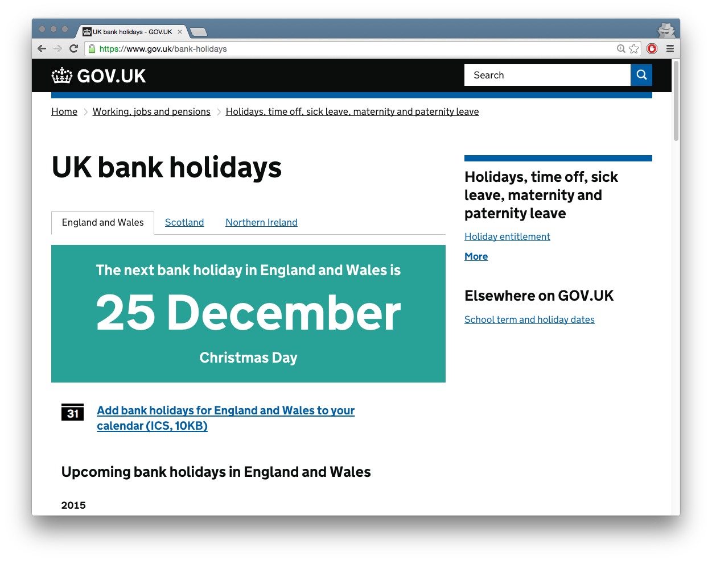

## Calendars

Serves calendars in a clear and accessible format, along with JSON and iCal exports of the data.

## Screenshots



## Live examples

- [Bank Holidays](https://www.gov.uk/bank-holidays)
- [Daylight Savings Time](https://www.gov.uk/when-do-the-clocks-change)

## Nomenclature

- **scope**: sach type of calendar (eg daylight saving, bank holidays) is known as a scope. A scope has its own view templates, JSON data source and primary route.

## Technical documentation

This is a Ruby on Rails application that serves static pages based on JSON files. It does not use a database.

JSON data files are stored in `lib/data/<scope>.json`, with a `divisions` hash for separate data per region (`united-kingdom`, `england-and-wales`, `scotland` or `northern-ireland`).

Each scope's data file contains a list of divisions, containing a list of years, each with a list of events:

```json
{
  "title": "UK bank holidays",
  "description": "UK bank holidays calendar - see UK bank holidays and public holidays for 2012 and 2013",
  "divisions": {
    "england-and-wales": {
      "title": "England and Wales",
      "2011": [{
        "title": "New Year's Day",
        "date": "02/01/2011",
        "notes": "Substitute day"
      }]
    }
  }
}
```

The division `title` attribute is optional.  If this is not present the slug will be humanized and used instead.

### Dependencies

- [panopticon](https://github.com/alphagov/panopticon): this app sends data to panopticon to register URLs and for search indexing.
- [publishing-api](https://github.com/alphagov/publishing-api): this app sends data to the content-store.

### Additional information

#### Publishing to GOV.UK

- `bundle exec rake panopticon:register` will send the calendars to panopticon. Panopticon will register the URL and send the data to Rummager for indexing in search.

#### Generate bank holidays JSON

A rake task has been created to generate the bank holidays JSON for a given year. They need to be then inserted, and modified to
take into account any additions/modifications made by proclamation.
Run the rake task like this:

    bundle exec rake bank_holidays:generate_json[2016]

#### Canonical sources

- For summer time, we can use the [Summer Time Act 1972](http://www.legislation.gov.uk/ukpga/1972/6).

- Bank holidays are determined both by law and by proclamation. We use the following legislation: the [Banking and Financial Dealings Act 1971](http://www.legislation.gov.uk/ukpga/1971/80/schedule/1)
and the [St Andrew's Day Bank Holiday Act](http://www.legislation.gov.uk/asp/2007/2/section/1).

- The proclamations of holidays are published in [The Gazette](https://www.thegazette.co.uk/all-notices/notice?noticetypes=1101&sort-by=latest-date&text="Banking+and+Financial").
Holidays are announced there 6 months to one year in advance, usually between the months of May and July for the following year.


### Running the application

`bundle exec bowl calendar www`

### Running the test suite

`bundle exec rake`

## Licence

[MIT License](LICENCE.txt)
